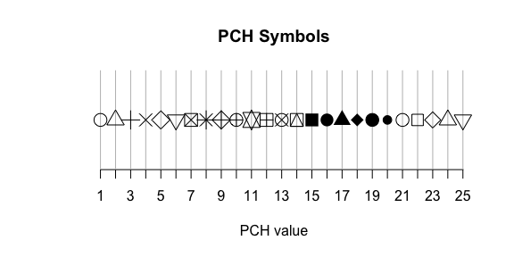

# Assignment 3
Isaiah Song  
October 10, 2014  

Complete the exercises listed below and submit as a pull request to the [Assignment 3 repository](http://www.github.com/microbialinformatics/assignment03).  Format this document approapriately using R markdown and knitr. For those cases where there are multiple outputs, make it clear in how you format the text and interweave the solution, what the solution is.

Your pull request should only include your *.Rmd and *.md files. You may work with a partner, but you must submit your own assignment and give credit to anyone that worked with you on the assignment and to any websites that you used along your way. You should not use any packages beyond the base R system and knitr.

This assignment is due on October 10th.

------

1.  Generate a plot that contains the different pch symbols. Investigate the knitr code chunk options to see whether you can have a pdf version of the image produced so you can print it off for yoru reference. It should look like this:

    
    

```r
plot(1:25,rep(15,25),pch=1:25,cex=2,axes=F,main="PCH Symbols",xlab="PCH value",ylab="") #Formed a chart of PCH symbols without axes
axis(1,at=1:25) #Added numbered x-axis
segments(x0=1:25,x1=1:25,y0=0,y1=30,col="gray") #Drew x-axis lines with line segments
```

 

2.  Using the `germfree.nmds.axes` data file available in this respositry, generate a plot that looks like this. The points are connected in the order they were sampled with the circle representing the beginning ad the square the end of the time course:

    


```r
germfree<-read.table(file="germfree.nmds.axes",header=T) #Read table
plot(1,type="n",xlim=c(-0.3,0.7),ylim=c(-0.55,0.4),xlab="NMDS Axis 1",ylab="NMDS Axis 2",cex.lab=0.75,cex.axis=0.75) #Blank plot

#Mouse 337 data
lines(germfree$axis2[germfree$mouse==337]~germfree$axis1[germfree$mouse==337],lwd=2)
points(0.477973,-0.364076,pch=19,cex=2)
points(-0.281808,-0.283736,pch=15,cex=2)

#Mouse 343 data
lines(germfree$axis2[germfree$mouse==343]~germfree$axis1[germfree$mouse==343],lwd=2,col="blue")
points(0.500614,-0.313138,pch=19,cex=2,col="blue")
points(-0.160445,-0.173750,pch=15,cex=2,col="blue")

#Mouse 361 data
lines(germfree$axis2[germfree$mouse==361]~germfree$axis1[germfree$mouse==361],lwd=2,col="red")
points(0.492443,-0.288620,pch=19,cex=2,col="red")
points(-0.140312,-0.179001,pch=15,cex=2,col="red")

#Mouse 387 data
lines(germfree$axis2[germfree$mouse==387]~germfree$axis1[germfree$mouse==387],lwd=2,col="green")
points(0.576080,-0.345484,pch=19,cex=2,col="green")
points(-0.212042,-0.233758,pch=15,cex=2,col="green")

#Mouse 389 data
lines(germfree$axis2[germfree$mouse==389]~germfree$axis1[germfree$mouse==389],lwd=2,col="brown")
points(0.333411,-0.175003,pch=19,cex=2,col="brown")
points(-0.266423,-0.221247,pch=15,cex=2,col="brown")

#Legend
legend(x=0,y=-0.2,legend=c("Mouse 337","Mouse 343","Mouse 361","Mouse 387","Mouse 389"),col=c("black","blue","red","green","brown"),lty=1,lwd=2,cex=0.75)
```

 

3.  On pg. 57 there is a formula for the probability of making x observations after n trials when there is a probability p of the observation.  For this exercise, assume x=2, n=10, and p=0.5.  Using R, calculate the probability of x using this formula and the appropriate built in function. Compare it to the results we obtained in class when discussing the sex ratios of mice.


```r
pdiscrete.formula<-((factorial(10))/(factorial(2)*factorial(8)))*(0.5^2)*((1-0.5)^(10-2)) #Calculated probability using formula

pdiscrete.dbinom<-dbinom(2,10,0.5) #Calculated probability using built-in R function
```

The formula gives a probability of 0.0439, and the R function gives the same result of 0.0439.  The values used in these calculations are identical to the values used to calculate the probability of observing 2 males in a litter of 10 mice (assuming that there is a 50% chance of being either male or female).  Thus, the results obtained in class match the results of this question in that the probability is also 0.0439.

4.  On pg. 59 there is a formula for the probability of observing a value, x, when there is a mean, mu, and standard deviation, sigma.  For this exercise, assume x=10.3, mu=5, and sigma=3.  Using R, calculate the probability of x using this formula and the appropriate built in function


```r
pcontinuous.formula<-(1/(sqrt(2*pi)*3))*exp(-((10.3-5)^2)/(2*3^2)) #Calculated probability using formula

pcontinuous.dnorm<-dnorm(10.3,5,3) #Calculated probability using built-in R function
```

The result calculated using the formula is 0.0279 and the result of using the R function is also 0.0279.

5.  One of my previous students, Joe Zackular, obtained stool samples from 89 people that underwent colonoscopies.  30 of these individuals had no signs of disease, 30 had non-cancerous ademonas, and 29 had cancer.  It was previously suggested that the bacterium *Fusobacterium nucleatum* was associated with cancer.  In these three pools of subjects, Joe determined that 4, 1, and 14 individuals harbored *F. nucleatum*, respectively. Create a matrix table to represent the number of individuals with and without _F. nucleatum_ as a function of disease state.  Then do the following:


```r
#Matrix
F.nucleatum<-matrix(c(26,4,29,1,15,14),nrow=3,byrow=TRUE)
rownames(F.nucleatum)=c("Healthy","Non-cancerous ademonas","Cancer")
colnames(F.nucleatum)=c("F. nucleatum negative","F. nucleatum positive")
F.nucleatum
```

```
##                        F. nucleatum negative F. nucleatum positive
## Healthy                                   26                     4
## Non-cancerous ademonas                    29                     1
## Cancer                                    15                    14
```

    * Run the three tests of proportions you learned about in class using built in R  functions to the 2x2 study design where normals and adenomas are pooled and compared to carcinomas.
    

```r
#Pooled matrix
F.nucleatum.pooled<-matrix(c(55,5,15,14),nrow=2,byrow=TRUE)
rownames(F.nucleatum.pooled)=c("Cancer negative","Cancer positive")
colnames(F.nucleatum.pooled)=c("F. nucleatum negative","F. nucleatum positive")

chisq.test(F.nucleatum.pooled) #Chi-squared test
```

```
## 
## 	Pearson's Chi-squared test with Yates' continuity correction
## 
## data:  F.nucleatum.pooled
## X-squared = 16.27, df = 1, p-value = 5.482e-05
```

```r
fisher.test(F.nucleatum.pooled) #Fisher test
```

```
## 
## 	Fisher's Exact Test for Count Data
## 
## data:  F.nucleatum.pooled
## p-value = 4.094e-05
## alternative hypothesis: true odds ratio is not equal to 1
## 95 percent confidence interval:
##   2.832 41.155
## sample estimates:
## odds ratio 
##      9.926
```

```r
prop.test(F.nucleatum.pooled) #Test of proportions
```

```
## 
## 	2-sample test for equality of proportions with continuity
## 	correction
## 
## data:  F.nucleatum.pooled
## X-squared = 16.27, df = 1, p-value = 5.482e-05
## alternative hypothesis: two.sided
## 95 percent confidence interval:
##  0.1790 0.6199
## sample estimates:
## prop 1 prop 2 
## 0.9167 0.5172
```

A low p-value in each test indicates that there is a significant difference in the presence of F.nucleatum in subjects with and without cancer.

    * Without using the built in chi-squared test function, replicate the 2x2 study design in the last problem for the Chi-Squared Test...

      * Calculate the expected count matrix and calculate the Chi-Squared test statistics. Figure out how to get your test statistic to match Rs default statistic.
      

```r
cancer.sums<-margin.table(F.nucleatum.pooled,1) #Cancer data
F.nucleatum.sums<-margin.table(F.nucleatum.pooled,2) #F. nucleatum data

frac.cancernegative<-cancer.sums["Cancer negative"]/sum(cancer.sums) #Proportion of all subjects who do not have cancer
frac.cancerpositive<-cancer.sums["Cancer positive"]/sum(cancer.sums) #Proportion of all subjects who have cancer
frac.cancer<-c(frac.cancernegative,frac.cancerpositive) #All cancer proportions

frac.F.nucleatumnegative<-F.nucleatum.sums["F. nucleatum negative"]/sum(F.nucleatum.sums) #Proportion of all subjects who do not have F. nucleatum
frac.F.nucleatumpositive<-F.nucleatum.sums["F. nucleatum positive"]/sum(F.nucleatum.sums) #Proportion of all subjects who have F. nucleatum
frac.F.nucleatum<-c(frac.F.nucleatumnegative,frac.F.nucleatumpositive) #All F. nucleatum proportions

F.nucleatum.expected<-(frac.cancer%*%t(frac.F.nucleatum))*sum(F.nucleatum.pooled) #All F. nucleatum 
rownames(F.nucleatum.expected)=c("Cancer negative","Cancer positive") #Clarified rows
F.nucleatum.expected
```

```
##                 F. nucleatum negative F. nucleatum positive
## Cancer negative                 47.19                12.809
## Cancer positive                 22.81                 6.191
```

```r
F.nucleatum.chisq<-sum(((F.nucleatum.expected-F.nucleatum.pooled)^2)/F.nucleatum.expected) #Chi-squared calculation
F.nucleatum.chisq
```

```
## [1] 18.58
```

```r
chisq.test(F.nucleatum.pooled) #Chi-squared test function in R
```

```
## 
## 	Pearson's Chi-squared test with Yates' continuity correction
## 
## data:  F.nucleatum.pooled
## X-squared = 16.27, df = 1, p-value = 5.482e-05
```

```r
F.nucleatum.chisq2<-sum(((abs(F.nucleatum.expected-F.nucleatum.pooled)-0.5)^2)/F.nucleatum.expected) #Applied Yates' continuity correction to calculation to match R function results
F.nucleatum.chisq2
```

```
## [1] 16.27
```

The calculated chi-squared value is 18.5763 before the Yates' continuity correction, after which it becomes 16.2736.

      *	Generate a Chi-Squared distributions with approporiate degrees of freedom by the method that was discussed in class (hint: you may consider using the `replicate` command)
      

```r
chisq.dist<-replicate(100000,sum((rnorm(1,0,1))^2)) #Draw 1 random variable (df=1) from normal distribution with mean=0 and SD=1, square and sum, repeat 100,000 times
hist(chisq.dist,breaks=200)
```

 

      * Compare your Chi-Squared distributions to what you might get from the appropriate built in R functions
      

```r
#Chi-squared plot
F.nucleatum.df<-(nrow(F.nucleatum.pooled)-1)*(ncol(F.nucleatum.pooled)-1)
plot(seq(0, 20, 0.05), dchisq(seq(0, 20, 0.05), df = F.nucleatum.df), type = "l", xlab = "Chi-Squared Statistic", 
ylab = "Probability with 1 degree of freedom")
arrows(x0 = F.nucleatum.chisq2, x1 = F.nucleatum.chisq2, y0 = 0.4, y1 = 0.05, lwd = 2, col = "red")
```

 

      * Based on your distribution calculate p-values
      

```r
chisq.dist[chisq.dist>F.nucleatum.chisq2] #Returns number of randomly generated values (out of 100,000) from normal distribution that are greater than the calculated chi-squared value
```

```
## [1] 16.31 17.66 17.50 20.10 17.44 16.40
```

```r
pvalue<-6/100000 #The proportion of the distribution greater than the chi-squared value is the p-value
pvalue
```

```
## [1] 6e-05
```
      * How does your p-value compare to what you saw using the built in functions? Explain your observations.

The p-value found using the generated chi-squared distribution is very slightly different from the p-value calculated using the functions in R.  This difference can be accounted for by the fact that R uses a continuous distribution to calculate the p-value rather than the manually generated discrete distribution.  Not even 100,000 replications are enough to perfectly simulate the continuous distribution functions used in R.


6\.  Get a bag of Skittles or M&Ms.  Are the candies evenly distributed amongst the different colors?  Justify your conclusion.

