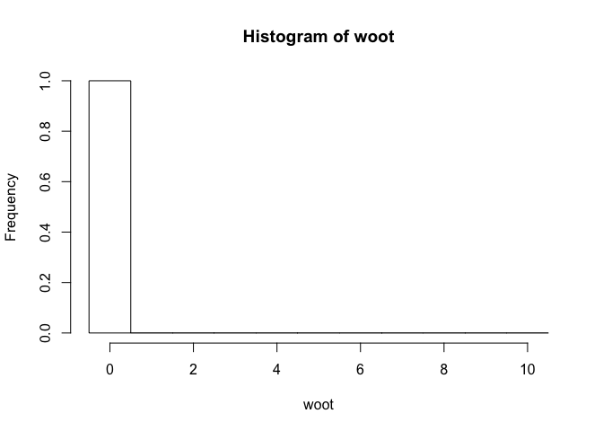

# Assignment 3
Patrick D. Schloss  
September 26, 2014  

Complete the exercises listed below and submit as a pull request to the [Assignment 3 repository](http://www.github.com/microbialinformatics/assignment03).  Format this document approapriately using R markdown and knitr. For those cases where there are multiple outputs, make it clear in how you format the text and interweave the solution, what the solution is.

Your pull request should only include your *.Rmd and *.md files. You may work with a partner, but you must submit your own assignment and give credit to anyone that worked with you on the assignment and to any websites that you used along your way. You should not use any packages beyond the base R system and knitr.

This assignment is due on October 10th.

------

1.  Generate a plot that contains the different pch symbols. Investigate the knitr code chunk options to see whether you can have a pdf version of the image produced so you can print it off for your reference. It should look like this:

    

```r
#creating vectors for PCH value positioning.
xaxis<-seq(1:25)
yaxis<-rep(c(.5),25)
#creating plot with PCH types by their number. This PDF statement makes a PDF file of the plot.
pdf("PCHplot.PDF")
plot(xaxis,yaxis, pch=c(1:25),col="black", lwd=1, main="PCH Symbols", ylab=" ", xlab="PCH Value", axes=F, pin=c(1,4))
#formatting axis
axis(1, at= seq(1,25, by= 1), las=1, tck=.7,col="grey", ylab="n", ps=12,)
axis(1, at=seq(1,25, by=1), col="black")
#adding darker x axis
```

```r
# repeating my code so that I can produce a visible graph on this assignment
plot(xaxis,yaxis, pch=c(1:25),col="black", lwd=1, main="PCH Symbols", ylab=" ", xlab="PCH Value", axes=F, pin=c(1,4))
#formatting axis
axis(1, at= seq(1,25, by= 1), las=1, tck=.7,col="grey", ylab="n", ps=12,)
axis(1, at=seq(1,25, by=1), col="black")
```

 

```
2.  Using the `germfree.nmds.axes` data file available in this respositry, generate a plot that looks like this. The points are connected in the order they were sampled with the circle representing the beginning ad the square the end of the time course:

    


```r
#making germfree file a variable.
germfree<- read.table(file="germfree.nmds.axes", header=T)
#check that germfree has all values and variables
germfree
```

```
##     mouse day     axis1     axis2
## 1     337   1  0.477973 -0.364076
## 2     337   2  0.441820 -0.376019
## 3     337   3  0.240472 -0.016919
## 4     337   4  0.035907  0.148944
## 5     337   5  0.001148  0.169266
## 6     337   6  0.060294  0.146779
## 7     337   7  0.034812  0.258245
## 8     337   8 -0.106733  0.194308
## 9     337   9 -0.076234  0.129926
## 10    337  10 -0.105765  0.131460
## 11    337  11 -0.064406  0.109985
## 12    337  12 -0.076967 -0.008170
## 13    337  13 -0.083959  0.019575
## 14    337  14 -0.054133 -0.045761
## 15    337  15 -0.020664 -0.081768
## 16    337  16 -0.088294 -0.114602
## 17    337  17 -0.068480 -0.146309
## 18    337  18 -0.202989 -0.184626
## 19    337  19 -0.316568 -0.257749
## 20    337  20 -0.281808 -0.283736
## 21    343   1  0.500614 -0.313138
## 22    343   2  0.234031 -0.105074
## 23    343   3  0.686308  0.390601
## 24    343   4  0.231436  0.185242
## 25    343   5 -0.000129  0.213364
## 26    343   6 -0.010586  0.213188
## 27    343   7  0.008319  0.197056
## 28    343   8 -0.055556  0.225044
## 29    343   9 -0.068226  0.218873
## 30    343  10 -0.097248  0.211134
## 31    343  11 -0.056036  0.154331
## 32    343  12 -0.166009  0.213856
## 33    343  13 -0.136185  0.241734
## 34    343  14 -0.060781  0.103322
## 35    343  15 -0.024760  0.031184
## 36    343  16 -0.114855 -0.011415
## 37    343  17 -0.051336 -0.159101
## 38    343  18 -0.229925 -0.210989
## 39    343  19 -0.249601 -0.312992
## 40    343  20 -0.261964 -0.248252
## 41    343  21 -0.160445 -0.173750
## 42    361   1  0.492443 -0.288620
## 43    361   2  0.409547 -0.277205
## 44    361   3  0.426351  0.102073
## 45    361   4  0.083652  0.018309
## 46    361   5  0.070610  0.201763
## 47    361   6  0.005623  0.249888
## 48    361   7  0.002963  0.192454
## 49    361   8 -0.144754  0.274811
## 50    361   9 -0.193524  0.251376
## 51    361  10 -0.180832  0.168392
## 52    361  11 -0.092199  0.044566
## 53    361  12 -0.131652  0.002556
## 54    361  14 -0.049513  0.014129
## 55    361  15 -0.046198 -0.057112
## 56    361  16 -0.101780 -0.089272
## 57    361  17 -0.097417 -0.095140
## 58    361  18 -0.171424 -0.186522
## 59    361  19 -0.258013 -0.271911
## 60    361  20 -0.239837 -0.267637
## 61    361  21 -0.140312 -0.179001
## 62    387   1  0.576080 -0.345484
## 63    387   2  0.615570 -0.323921
## 64    387   3  0.700632 -0.111734
## 65    387   4  0.388111  0.208005
## 66    387   5  0.042856  0.244308
## 67    387   6  0.156916  0.253384
## 68    387   7  0.054116  0.347638
## 69    387   8 -0.044162  0.188470
## 70    387   9 -0.080200  0.263068
## 71    387  10 -0.121073  0.178870
## 72    387  11 -0.101629  0.120854
## 73    387  12 -0.096233  0.107505
## 74    387  13 -0.117344  0.061644
## 75    387  14 -0.262439  0.121708
## 76    387  15  0.018423 -0.034276
## 77    387  16 -0.061813 -0.059084
## 78    387  17 -0.053700 -0.109535
## 79    387  18 -0.116989 -0.129478
## 80    387  19 -0.179320 -0.549998
## 81    387  20 -0.297947 -0.269588
## 82    387  21 -0.212042 -0.233758
## 83    389   1  0.333411 -0.175003
## 84    389   2  0.352974 -0.276592
## 85    389   3  0.222567 -0.001889
## 86    389   4  0.295203  0.188232
## 87    389   5  0.038725  0.206953
## 88    389   6  0.002329  0.152992
## 89    389   7  0.009097  0.173503
## 90    389   8 -0.064849  0.202872
## 91    389   9 -0.037609  0.126207
## 92    389  10 -0.109734  0.167615
## 93    389  11 -0.044272  0.133182
## 94    389  12 -0.119429  0.239419
## 95    389  13  0.002219  0.094769
## 96    389  14 -0.098458 -0.058467
## 97    389  15 -0.010906 -0.142936
## 98    389  16 -0.020310 -0.129824
## 99    389  17 -0.060223 -0.163624
## 100   389  18 -0.139415 -0.191099
## 101   389  19 -0.179398 -0.245192
## 102   389  20 -0.219536 -0.309335
## 103   389  21 -0.266423 -0.221247
```

```r
#sorting by mouse and then day
attach(germfree)
sortedgermfree<-germfree[order(mouse,day),]
detach(germfree)
#making mouse a factor
mousefactor<-as.factor(sortedgermfree$mouse)
mousefactor
```

```
##   [1] 337 337 337 337 337 337 337 337 337 337 337 337 337 337 337 337 337
##  [18] 337 337 337 343 343 343 343 343 343 343 343 343 343 343 343 343 343
##  [35] 343 343 343 343 343 343 343 361 361 361 361 361 361 361 361 361 361
##  [52] 361 361 361 361 361 361 361 361 361 361 387 387 387 387 387 387 387
##  [69] 387 387 387 387 387 387 387 387 387 387 387 387 387 387 389 389 389
##  [86] 389 389 389 389 389 389 389 389 389 389 389 389 389 389 389 389 389
## [103] 389
## Levels: 337 343 361 387 389
```

```r
sortedgermfree$new.col<-mousefactor
sortedgermfree
```

```
##     mouse day     axis1     axis2 new.col
## 1     337   1  0.477973 -0.364076     337
## 2     337   2  0.441820 -0.376019     337
## 3     337   3  0.240472 -0.016919     337
## 4     337   4  0.035907  0.148944     337
## 5     337   5  0.001148  0.169266     337
## 6     337   6  0.060294  0.146779     337
## 7     337   7  0.034812  0.258245     337
## 8     337   8 -0.106733  0.194308     337
## 9     337   9 -0.076234  0.129926     337
## 10    337  10 -0.105765  0.131460     337
## 11    337  11 -0.064406  0.109985     337
## 12    337  12 -0.076967 -0.008170     337
## 13    337  13 -0.083959  0.019575     337
## 14    337  14 -0.054133 -0.045761     337
## 15    337  15 -0.020664 -0.081768     337
## 16    337  16 -0.088294 -0.114602     337
## 17    337  17 -0.068480 -0.146309     337
## 18    337  18 -0.202989 -0.184626     337
## 19    337  19 -0.316568 -0.257749     337
## 20    337  20 -0.281808 -0.283736     337
## 21    343   1  0.500614 -0.313138     343
## 22    343   2  0.234031 -0.105074     343
## 23    343   3  0.686308  0.390601     343
## 24    343   4  0.231436  0.185242     343
## 25    343   5 -0.000129  0.213364     343
## 26    343   6 -0.010586  0.213188     343
## 27    343   7  0.008319  0.197056     343
## 28    343   8 -0.055556  0.225044     343
## 29    343   9 -0.068226  0.218873     343
## 30    343  10 -0.097248  0.211134     343
## 31    343  11 -0.056036  0.154331     343
## 32    343  12 -0.166009  0.213856     343
## 33    343  13 -0.136185  0.241734     343
## 34    343  14 -0.060781  0.103322     343
## 35    343  15 -0.024760  0.031184     343
## 36    343  16 -0.114855 -0.011415     343
## 37    343  17 -0.051336 -0.159101     343
## 38    343  18 -0.229925 -0.210989     343
## 39    343  19 -0.249601 -0.312992     343
## 40    343  20 -0.261964 -0.248252     343
## 41    343  21 -0.160445 -0.173750     343
## 42    361   1  0.492443 -0.288620     361
## 43    361   2  0.409547 -0.277205     361
## 44    361   3  0.426351  0.102073     361
## 45    361   4  0.083652  0.018309     361
## 46    361   5  0.070610  0.201763     361
## 47    361   6  0.005623  0.249888     361
## 48    361   7  0.002963  0.192454     361
## 49    361   8 -0.144754  0.274811     361
## 50    361   9 -0.193524  0.251376     361
## 51    361  10 -0.180832  0.168392     361
## 52    361  11 -0.092199  0.044566     361
## 53    361  12 -0.131652  0.002556     361
## 54    361  14 -0.049513  0.014129     361
## 55    361  15 -0.046198 -0.057112     361
## 56    361  16 -0.101780 -0.089272     361
## 57    361  17 -0.097417 -0.095140     361
## 58    361  18 -0.171424 -0.186522     361
## 59    361  19 -0.258013 -0.271911     361
## 60    361  20 -0.239837 -0.267637     361
## 61    361  21 -0.140312 -0.179001     361
## 62    387   1  0.576080 -0.345484     387
## 63    387   2  0.615570 -0.323921     387
## 64    387   3  0.700632 -0.111734     387
## 65    387   4  0.388111  0.208005     387
## 66    387   5  0.042856  0.244308     387
## 67    387   6  0.156916  0.253384     387
## 68    387   7  0.054116  0.347638     387
## 69    387   8 -0.044162  0.188470     387
## 70    387   9 -0.080200  0.263068     387
## 71    387  10 -0.121073  0.178870     387
## 72    387  11 -0.101629  0.120854     387
## 73    387  12 -0.096233  0.107505     387
## 74    387  13 -0.117344  0.061644     387
## 75    387  14 -0.262439  0.121708     387
## 76    387  15  0.018423 -0.034276     387
## 77    387  16 -0.061813 -0.059084     387
## 78    387  17 -0.053700 -0.109535     387
## 79    387  18 -0.116989 -0.129478     387
## 80    387  19 -0.179320 -0.549998     387
## 81    387  20 -0.297947 -0.269588     387
## 82    387  21 -0.212042 -0.233758     387
## 83    389   1  0.333411 -0.175003     389
## 84    389   2  0.352974 -0.276592     389
## 85    389   3  0.222567 -0.001889     389
## 86    389   4  0.295203  0.188232     389
## 87    389   5  0.038725  0.206953     389
## 88    389   6  0.002329  0.152992     389
## 89    389   7  0.009097  0.173503     389
## 90    389   8 -0.064849  0.202872     389
## 91    389   9 -0.037609  0.126207     389
## 92    389  10 -0.109734  0.167615     389
## 93    389  11 -0.044272  0.133182     389
## 94    389  12 -0.119429  0.239419     389
## 95    389  13  0.002219  0.094769     389
## 96    389  14 -0.098458 -0.058467     389
## 97    389  15 -0.010906 -0.142936     389
## 98    389  16 -0.020310 -0.129824     389
## 99    389  17 -0.060223 -0.163624     389
## 100   389  18 -0.139415 -0.191099     389
## 101   389  19 -0.179398 -0.245192     389
## 102   389  20 -0.219536 -0.309335     389
## 103   389  21 -0.266423 -0.221247     389
```

```r
#creating plot
plot((sortedgermfree$axis2~sortedgermfree$axis1), type="l", xlim = c(-.2,.6), ylim =c(-.4,0.4), ylab= "NMDS Axis 2", xlab="NMDS Axis 1" , par(mar=c(7,5,1.5,1)), asp=2) 
lines(sortedgermfree$new.col=="337", col="red")

lines(sortedgermfree$mouse=="337", col="black")
lines(sortedgermfree$mouse=="343", col="blue")
lines(sortedgermfree$mouse=="361", col="red")
lines(sortedgermfree$mouse=="387", col="green")
lines(sortedgermfree$mouse=="389", col="brown")
```

 

3.  On pg. 57 there is a formula for the probability of making x observations after n trials when there is a probability p of the observation.  For this exercise, assume x=2, n=10, and p=0.5.  Using R, calculate the probability of x using this formula and the appropriate built in function. Compare it to the results we obtained in class when discussing the sex ratios of mice.

```r
#by hand
n<-factorial(10)
x<-(factorial(2)*factorial(8))
book<-n/x*(.5)^2*(1-.5)^8
book
```

```
## [1] 0.04395
```

```r
#with r
withrdbinom<-dbinom(2, 10,.5)
withrdbinom
```

```
## [1] 0.04395
```
Answer: with the formula on pg 57, the probability was 0.0439, with the dbinom function in r the probability was also 0.0439. When we discussed sex ratios in mice in class, we also calculated this exact probability, as we had the same parameters as in this question (2 males in a litter of 10 mice, with a probability of male = 0.5.)

4.  On pg. 59 there is a formula for the probability of observing a value, x, when there is a mean, mu, and standard deviation, sigma.  For this exercise, assume x=10.3, mu=5, and sigma=3.  Using R, calculate the probability of x using this formula and the appropriate built in function


```r
#fraction part
rt<- sqrt(2*pi)
three.rt<-3*rt
check.fx<-((1/three.rt)*exp(-((10.3-5)^2/(2*3^2))))
check.fx
```

```
## [1] 0.02793
```

```r
#second part of the question using the built in function for the normal distribution.
builtin<-dnorm(x = 10.3, mean = 5, sd = 3)
builtin
```

```
## [1] 0.02793
```
Answer: the probability is 0.0279

Using the built in function dnorm, the probability is 0.0279 

5.  One of my previous students, Joe Zackular, obtained stool samples from 89 people that underwent colonoscopies.  30 of these individuals had no signs of disease, 30 had non-cancerous ademonas, and 29 had cancer.  It was previously suggested that the bacterium *Fusobacterium nucleatum* was associated with cancer.  In these three pools of subjects, Joe determined that 4, 1, and 14 individuals harbored *F. nucleatum*, respectively. Create a matrix table to represent the number of individuals with and without _F. nucleatum_ as a function of disease state.  Then do the following:


```r
#creating matrix
cancer<- matrix(c(26,29,15,4,1,14), nrow=2, ncol=3, byrow=T)
#adding row and column names
colnames(cancer)<-c("no disease", "cancerous adenomas", "cancer")
rownames(cancer)<-c("no F. nucleatum", "F. nucleatum")
cancer
```

```
##                 no disease cancerous adenomas cancer
## no F. nucleatum         26                 29     15
## F. nucleatum             4                  1     14
```
Answer: 26, 4, 29, 1, 15, 14

    * Run the three tests of proportions you learned about in class using built in R  functions to the 2x2 study design where normals and adenomas are pooled and compared to carcinomas.


```r
#creating pooled table for normals + adenomas vs carcinomas
pooled<- matrix(c(55,5,15,14), nrow=2, ncol=2)
#adding row and column names
#want to compare colonization status  by cancer status
colnames(pooled)<-c("no cancer", "cancer")
rownames(pooled)<-c("no F.nucleatum", "F.nucleatum")
pooled
```

```
##                no cancer cancer
## no F.nucleatum        55     15
## F.nucleatum            5     14
```

```r
#generating test output
proportion.test<-prop.test(pooled)
proportion.test
```

```
## 
## 	2-sample test for equality of proportions with continuity
## 	correction
## 
## data:  pooled
## X-squared = 16.27, df = 1, p-value = 5.482e-05
## alternative hypothesis: two.sided
## 95 percent confidence interval:
##  0.2690 0.7761
## sample estimates:
## prop 1 prop 2 
## 0.7857 0.2632
```

```r
fisher.test<-fisher.test(pooled)
fisher.test
```

```
## 
## 	Fisher's Exact Test for Count Data
## 
## data:  pooled
## p-value = 4.094e-05
## alternative hypothesis: true odds ratio is not equal to 1
## 95 percent confidence interval:
##   2.832 41.155
## sample estimates:
## odds ratio 
##      9.926
```

```r
chisquare.test<-chisq.test(pooled)
chisquare.test
```

```
## 
## 	Pearson's Chi-squared test with Yates' continuity correction
## 
## data:  pooled
## X-squared = 16.27, df = 1, p-value = 5.482e-05
```
Answer: With all three tests there appears to be a significant difference in the proportion of patients who with *F. nucleatum* by cancer status.  

     * Without using the built in chi-squared test function, replicate the 2x2 study design in the last problem for the Chi-Squared Test...


```r
#generating the observed r by c table:
pooled
```

```
##                no cancer cancer
## no F.nucleatum        55     15
## F.nucleatum            5     14
```

```r
#generating the expected table
colonization.sums<- margin.table(pooled,1)
colonization.sums
```

```
## no F.nucleatum    F.nucleatum 
##             70             19
```

```r
fract.fnuc<-colonization.sums["F.nucleatum"]/sum(colonization.sums)
fract.nofnuc<- 1-fract.fnuc
fract.bac<-c(noFnuc= fract.nofnuc, Fnuc = fract.fnuc)
fract.bac
```

```
## noFnuc.F.nucleatum   Fnuc.F.nucleatum 
##             0.7865             0.2135
```

```r
cancer.sums<-margin.table(pooled,2)
cancer.sums
```

```
## no cancer    cancer 
##        60        29
```

```r
fract.nocancer<-cancer.sums["no cancer"]/sum(cancer.sums)
fract.cancer<-1-fract.nocancer
fract.disease<-c(healthy= fract.nocancer, cancer= fract.cancer)
fract.disease
```

```
## healthy.no cancer  cancer.no cancer 
##            0.6742            0.3258
```

```r
expected<-fract.bac %*% t(fract.disease)
expected<-expected*sum(pooled)
expected
```

```
##      healthy.no cancer cancer.no cancer
## [1,]             47.19           22.809
## [2,]             12.81            6.191
```

```r
#chisquare test to match r, add yates continuity correction
regchisq<- sum((expected-pooled)^2/expected)
regchisq
```

```
## [1] 18.58
```

```r
uncorrected<-sum((abs(expected-pooled)-0.5)^2/(expected))
uncorrected
```

```
## [1] 16.27
```
     * Calculate the expected count matrix and calculate the Chi-Squared test statistics. Figure out how to get your test statistic to match Rs default statistic.     
      
Answer: without the continuity correction, my chi suqare test statistic was 18.5763 ,  After deleting the correction for continuity, my chi square value is 16.2736, this is identical to r's default parameter chisquare test statistic.
 
      *	Generate a Chi-Squared distribution with approporiate degrees of freedom by the method that was discussed in class (hint: you may consider using the `replicate` command)
      

```r
#pick k=df=1 random variable from the normal dist
#replicate this 1000 times
repchisqplot<-replicate(1000,(sum(rnorm(1))^2))
summary(repchisqplot)
```

```
##    Min. 1st Qu.  Median    Mean 3rd Qu.    Max. 
##   0.000   0.098   0.402   0.976   1.190  10.900
```

```r
#find numbers that are greater than our test statistic
larger<-which(repchisqplot>16.2738)
#there are no instances where we sampled values greater than the test statistic.
```
 
* Compare your Chi-Squared distributions to what you might get      from the appropriate built in R functions

Answer: there are no instances where a test statistic drawn from the chi squared df=1 distribution were larger than the test statistic that I calculated with the built in functions.

 * Based on your distribution calculate p-values
 

```r
df<-(nrow(pooled)-1)*(ncol(pooled)-1)
my.chi.sq<-uncorrected
my.chi.sq
```

```
## [1] 16.27
```

```r
plot(seq(0,20,0.05), dchisq(seq(0,20,0.05), df=df), type="l", xlab="chisquared test statistic", ylab="probability with 1 defree of freedom")
#adding arrows for my chi square test statistic
arrows(x0=my.chi.sq, x1=my.chi.sq, y0=0.4, y1=0.05, lwd=2, col="red")
```

 

```r
#calculate p values based on my distribution
pvalchisq<-pnorm(repchisqplot)
#compare to p value from r chi squared calculations
many<-which(pvalchisq<5.482e-05)
manyone<-which(pvalchisq<0.05)
#plot p values to observe their distribution
hist(pnorm(repchisqplot), main="p-values obvserved,Chisquared df=1", xlab="p value")
```

 

      * How does your p-value compare to what you saw using the built in functions? Explain your observations.
  
Answer: With the built in chisquared test with yates continuity correction, the p-values were highly significant at 5.482e-05, and without the yates continuity correction, 1.632e-05. This indicates that on repeat sampling, there is a very very small chance that these differences between groups would be ovserved by change or random variation alone. When I replicated choosing 1000 samples from the chisquared distribution with DF=1, the Chisquare values I sampled were all smaller than the chisquared test statistic I calculated with r's built in functions. The corresponding p values I observed were in no, instances equal to or smaller than the built in function p values or 0.05. This failure to detect significance on repeat sampling makes sense given the highly significant p values calculated from the data with the built in r functions. 
      


6\.  Get a bag of Skittles or M&Ms.  Are the candies evenly distributed amongst the different colors?  Justify your conclusion.

```r
#creating matrix with my peanut m&m data
peanut<-matrix(c(3,8,2,8,5,12), nrow=1)
colnames(peanut)<-c("brown", "green","red","blue","yellow","orange")
#calculating proportion of each color observed
propPeanut<-(peanut/38)
propPeanut
```

```
##        brown  green     red   blue yellow orange
## [1,] 0.07895 0.2105 0.05263 0.2105 0.1316 0.3158
```

```r
#calculating expected null proportions if the colors were distributed evenly
expectedprop<-6/38
expectedprop
```

```
## [1] 0.1579
```

```r
peanutexp<-matrix(c(0.1578947,0.1578947,0.1578947,0.1578947,0.1578947,0.1578947), nrow=1)
colnames(peanutexp)<-c("brown", "green","red","blue","yellow","orange")
#plotting both observed and expected distributions
barplot((propPeanut), ylab= "color frequency", xlab="M&M color")
```

 

```r
barplot((peanutexp),col="gray",ylab= " Expected color frequency", xlab="M&M color")
```

 

```r
#now my question is if these proportions differ significantly from 0.1578947
#I am gong to do multiple binomial tests to see if each individual color could come from the binomial distribution with .1578947 probability
#brown
brown<-binom.test(3,38,0.16)
brown
```

```
## 
## 	Exact binomial test
## 
## data:  3 and 38
## number of successes = 3, number of trials = 38, p-value = 0.2648
## alternative hypothesis: true probability of success is not equal to 0.16
## 95 percent confidence interval:
##  0.01659 0.21377
## sample estimates:
## probability of success 
##                0.07895
```

```r
green<-binom.test(8,38,0.16)
green
```

```
## 
## 	Exact binomial test
## 
## data:  8 and 38
## number of successes = 8, number of trials = 38, p-value = 0.3771
## alternative hypothesis: true probability of success is not equal to 0.16
## 95 percent confidence interval:
##  0.09554 0.37319
## sample estimates:
## probability of success 
##                 0.2105
```

```r
red<-binom.test(2,38,0.16)
red
```

```
## 
## 	Exact binomial test
## 
## data:  2 and 38
## number of successes = 2, number of trials = 38, p-value = 0.07667
## alternative hypothesis: true probability of success is not equal to 0.16
## 95 percent confidence interval:
##  0.006439 0.177491
## sample estimates:
## probability of success 
##                0.05263
```

```r
blue<-binom.test(8,38,0.16)
blue
```

```
## 
## 	Exact binomial test
## 
## data:  8 and 38
## number of successes = 8, number of trials = 38, p-value = 0.3771
## alternative hypothesis: true probability of success is not equal to 0.16
## 95 percent confidence interval:
##  0.09554 0.37319
## sample estimates:
## probability of success 
##                 0.2105
```

```r
yellow<-binom.test(8,38,0.16)
yellow
```

```
## 
## 	Exact binomial test
## 
## data:  8 and 38
## number of successes = 8, number of trials = 38, p-value = 0.3771
## alternative hypothesis: true probability of success is not equal to 0.16
## 95 percent confidence interval:
##  0.09554 0.37319
## sample estimates:
## probability of success 
##                 0.2105
```

```r
orange<-binom.test(12, 38, 0.16)
orange
```

```
## 
## 	Exact binomial test
## 
## data:  12 and 38
## number of successes = 12, number of trials = 38, p-value = 0.01414
## alternative hypothesis: true probability of success is not equal to 0.16
## 95 percent confidence interval:
##  0.1750 0.4865
## sample estimates:
## probability of success 
##                 0.3158
```

```r
# these tests are a mixture of significant and non significant
chisqpeanut<-chisq.test(peanut)
chisqpeanut
```

```
## 
## 	Chi-squared test for given probabilities
## 
## data:  peanut
## X-squared = 10.95, df = 5, p-value = 0.05243
```

```r
answerpeanut<-chisqpeanut$statistic
pvaluepeanut<-chisqpeanut$p.value
```
Answer: 
The null hypothesis of this test is that all colors are evenly distributed in this bag of M&Ms and that the proportion of all colors is .1578947 (observed) or 1/6th of the sample (population).

The alternative hypothesis is that one of the color proportions is different. 

My tests failed to reject the null hypothesis.
the chisquared test was 10.9474  with a p value of 0.0524

This test is not significant at the 0.05 level of significance. However, it is close to 0.05.  

Graphic comparison of the poportions of each color in the bag with a uniform distribution of colors suggests that the distributions could be uneven.  

I also did binomial tests for each color against the uniform distribution. Only orange was significantly different from the expected porportion. If there was 10 orange instead of 12, this would not have been significant.

Since there is a trend towards nonsignificant in the bionomial tests, and the chisquare test gave non-significance, I am going to go with the chisquared results and say that the colors are not distributed significantly differently from the uniform distirubtion in this sample. 

