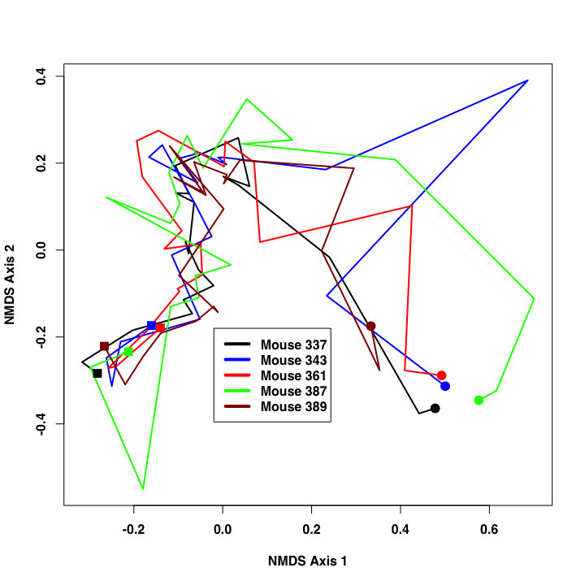

# Assignment 3
Amanda Elmore  
October 11, 2014  

Complete the exercises listed below and submit as a pull request to the [Assignment 3 repository](http://www.github.com/microbialinformatics/assignment03).  Format this document approapriately using R markdown and knitr. For those cases where there are multiple outputs, make it clear in how you format the text and interweave the solution, what the solution is.

Your pull request should only include your *.Rmd and *.md files. You may work with a partner, but you must submit your own assignment and give credit to anyone that worked with you on the assignment and to any websites that you used along your way. You should not use any packages beyond the base R system and knitr.

This assignment is due on October 10th.

------

1.  Generate a plot that contains the different pch symbols. Investigate the knitr code chunk options to see whether you can have a pdf version of the image produced so you can print it off for yoru reference. It should look like this:

    


```r
pdf("Elmoreplot.pdf") #save the plot to pdf
x<-c(1:25)
plot.pdf=plot(x, rep(1,25), axes=FALSE, main="PCH Symbols", xlab="PCH value", ylab="",  pch=c(1:25), cex=2)
axis(1, at = seq(1,25,1), label=x, tck=1, col.ticks="grey") #add hash marks
axis(1, at=seq(1,25,1), col.ticks="black") #add smaller black ticks
```

2.  Using the `germfree.nmds.axes` data file available in this respositry, generate a plot that looks like this. The points are connected in the order they were sampled with the circle representing the beginning ad the square the end of the time course:

    

```r
x<-read.table(file="germfree.nmds.axes", header=T)
x$mouse<-as.factor(x$mouse)
mouselevels<-levels(x$mouse) #make a variable with the mouse names to be used in a for loop
plot(x$axis1, x$axis2, type="n", xlab="NMDS Axis 1", ylab="NMDS Axis 2")
colors<-c("black","blue","red","green","dark red")
for (i in c(1:5)){ #print lines onto the plot for each of the mice individually with a different color
y <- subset(x,mouse==mouselevels[i])
y <- y[order(y$day),] #just in case the days are out of order
lines(y$axis1, y$axis2, col=colors[i], lwd=1.5)
day1<- subset(y, y$day==min(y$day))
day21<- subset(y, y$day==max(y$day))
points(day1$axis1, day1$axis2, pch=16, cex=2, col=colors[i])
points(day21$axis1, day21$axis2, pch=15, cex=2, col=colors[i])
}
legend(0,-.1, legend=c("Mouse 337", "Mouse 343","Mouse 361","Mouse 387","Mouse 389"), lwd=4,col=colors)
```

 

3.  On pg. 57 there is a formula for the probability of making x observations after n trials when there is a probability p of the observation.  For this exercise, assume x=2, n=10, and p=0.5.  Using R, calculate the probability of x using this formula and the appropriate built in function. Compare it to the results we obtained in class when discussing the sex ratios of mice.

```r
x<-2
n<-10
p<-0.5
binomial.formula <- choose(n,x)*p^x*(1-p)^(n-x)
binomial.builtin <- dbinom(x,n,p) #function built in to R that gives the probability of drawing a certain number of something from a binomial distribution (from Lecture 9)
```

**Answer: ** The probability of making 2 observations after 10 trials when there is a 0.5 probability of the observations is 0.0439 based on the actual formula and this is the same answer you get when using the binomial probability function built in to R (0.0439). The sex ratios example from lecture is the same because the probability of a male or female pup is 0.5.


4.  On pg. 59 there is a formula for the probability of observing a value, x, when there is a mean, mu, and standard deviation, sigma.  For this exercise, assume x=10.3, mu=5, and sigma=3.  Using R, calculate the probability of x using this formula and the appropriate built in function


```r
x<-10.3
mu<-5
sigma <- 3
formula <- 1/(sqrt(2*pi)*sigma)*exp(-(x-mu)^2/(2*sigma^2))
builtin <- dnorm(x,mu,sigma)
```
**Answer: ** The probability of observing the value 10.3 when thre is a mean 5 and standard deviation 3 is the same using the normal distribution formula (0.0279) and the R built in normal distribution function (0.0279).


5.  One of my previous students, Joe Zackular, obtained stool samples from 89 people that underwent colonoscopies.  30 of these individuals had no signs of disease, 30 had non-cancerous ademonas, and 29 had cancer.  It was previously suggested that the bacterium *Fusobacterium nucleatum* was associated with cancer.  In these three pools of subjects, Joe determined that 4, 1, and 14 individuals harbored *F. nucleatum*, respectively. Create a matrix table to represent the number of individuals with and without _F. nucleatum_ as a function of disease state.  Then do the following:

```r
x<- matrix(c(26,4,29,1,15,14), nrow=2,ncol=3)
colnames(x) <- c("Healthy", "Adenoma","Carcinoma")
rownames(x) <- c("Negative","Fuso")
x
```

```
##          Healthy Adenoma Carcinoma
## Negative      26      29        15
## Fuso           4       1        14
```


    * Run the three tests of proportions you learned about in class using built in R  functions to the 2x2 study design where normals and adenomas are pooled and compared to carcinomas.

```r
#Make the same matrix with the normal and adenoma patients pooled
x<- matrix(c(55,5,15,14), nrow=2,ncol=2)
colnames(x) <- c("None","Carcinoma")
rownames(x) <- c("Negative","Positive")
#Run the three tests we learned in class: binomial test, fisher test, and chi squared test  
prop.test(x)
```

```
## 
## 	2-sample test for equality of proportions with continuity
## 	correction
## 
## data:  x
## X-squared = 16.27, df = 1, p-value = 5.482e-05
## alternative hypothesis: two.sided
## 95 percent confidence interval:
##  0.2690 0.7761
## sample estimates:
## prop 1 prop 2 
## 0.7857 0.2632
```

```r
chisq.test(x)
```

```
## 
## 	Pearson's Chi-squared test with Yates' continuity correction
## 
## data:  x
## X-squared = 16.27, df = 1, p-value = 5.482e-05
```

```r
fisher.test(x)
```

```
## 
## 	Fisher's Exact Test for Count Data
## 
## data:  x
## p-value = 4.094e-05
## alternative hypothesis: true odds ratio is not equal to 1
## 95 percent confidence interval:
##   2.832 41.155
## sample estimates:
## odds ratio 
##      9.926
```
**Answer: **Using all three tests, we can conclude that there is a significant difference between cancer groups in the proportion of patients that have *F. nucleatum*.

 
       * Without using the built in chi-squared test function, replicate the 2x2 study design in the last problem for the Chi-Squared Test...

```r
#Make the same matrix with the normal and adenoma patients pooled
x<- matrix(c(55,5,15,14), nrow=2,ncol=2)
colnames(x) <- c("None","Carcinoma")
rownames(x) <- c("Negative","Positive")
#generate another matrix with the expected values. These are found from the (row total * column total)/overall total. I adapted this code from Lecture 10 with comments to show I understand.
Fuso.sums <- margin.table(x, 1) #Make table with fuso totals 

disease.sums <- margin.table(x, 2) #make table with disease totals 


#generate a vector called frac.Fuso that has the fraction of total patients that have fuso and the fraction that don't.
frac.negative <- Fuso.sums["Negative"]/sum(Fuso.sums) 
frac.positive <- 1 - frac.negative
frac.Fuso <- c(Negative=frac.negative, Positive=frac.positive)
frac.Fuso
```

```
## Negative.Negative Positive.Negative 
##            0.7865            0.2135
```

```r
#generate a vector called frac.disease that has the fraction of total patients that have cancer and the fraction that don't
frac.healthy <- disease.sums["None"]/sum(disease.sums) #total fraction of people that are healthy in the data set
frac.cancer <- 1 - frac.healthy
frac.disease <- c( None=frac.healthy, Carcinoma=frac.cancer)

expected <- frac.Fuso %*% t(frac.disease) #vector multiplication to generate a matrix with all of the expected proportions in the same positions as the real values in the original table
expected <- expected * sum(x) #multiply the proportions by the total value to get the expected number of observations for each condition

#The chi-squared test statistic is calculated by summing the squares of the difference between observed and expected and dividing by expected.
chisq<- sum((x-expected)^2/expected)

#including Yates continuitiy correction
yateschisq <- sum((abs(x-expected)-.5)^2/expected)
```

       
      * Calculate the expected count matrix and calculate the Chi-Squared test statistics. Figure out how to get your test statistic to match Rs default statistic.

**Answer: ** By creating an table of expected values and using the chisquared statistic formula, the test statistic came out to be 18.5763. However, the R built-in function includes Yates continuity correction. By using the corrected equation found on [Wikipedia](http://en.wikipedia.org/wiki/Yates's_correction_for_continuity), I got the same statistic as the built-in function (16.2736).
      
      *  Generate a Chi-Squared distributions with approporiate degrees of freedom by the method that was discussed in class (hint: you may consider using the `replicate` command)

      
      
      * Compare your Chi-Squared distributions to what you might get from the appropriate built in R functions

```r
#from lecture 10
df <- (nrow(x) - 1) * (ncol(x) - 1)
plot(seq(0, 20, 0.05), dchisq(seq(0, 20, 0.05), df = df), type = "l", xlab = "ChiSquared Statistic", 
    ylab = "Probability with 1 degree of freedom")
arrows(x0 = yateschisq, x1 = yateschisq, y0 = 0.4, y1 = 0.05, lwd = 2, col = "red")
```

 
      * Based on your distribution calculate p-values

```r
#p-value is the proportion greater than the test statistic
dist<- dchisq(seq(0,20,0.05), df=df) #we only need to sample to 20 because the values get very small
yateschisq<- as.integer(yateschisq*20) #do this to find the index of the chisq value in the distribution
sum(dist[yateschisq:400])
```

```
## [1] 0.0009981
```

```r
p
```

```
## [1] 0.5
```


      * How does your p-value compare to what you saw using the built in functions? Explain your observations.
**Answer: ** The p-value with yates continuity correction using the built-in distribution is 0.5. 

6\.  Get a bag of Skittles or M&Ms.  Are the candies evenly distributed amongst the different colors?  Justify your conclusion.

```r
s<- matrix(c(20, 22, 14, 30, 18), nrow=1,ncol=5)
colnames(s)<- c("green", "yellow","orange","red","purple")
chi<- chisq.test(s)
```
**Answer: ** The Chi-squared test evaluates how likely it is that the observed differences between the values happened by chance. The null hypothesis is that the differences between the number of Skittles in the bag happened by chance and that the candies are evenly distributed. If the p-value is very small, it would suggest that the null hypothesis is not true and there is a true difference between the candies. In my bag of skittles there were 20 green, 22 yellow, 14 orange, 30 red, and 18 purple candies. The chi-squared test gives a p-value of 0.1486 which is not significant. This suggests that the candies are evenly distributed.


