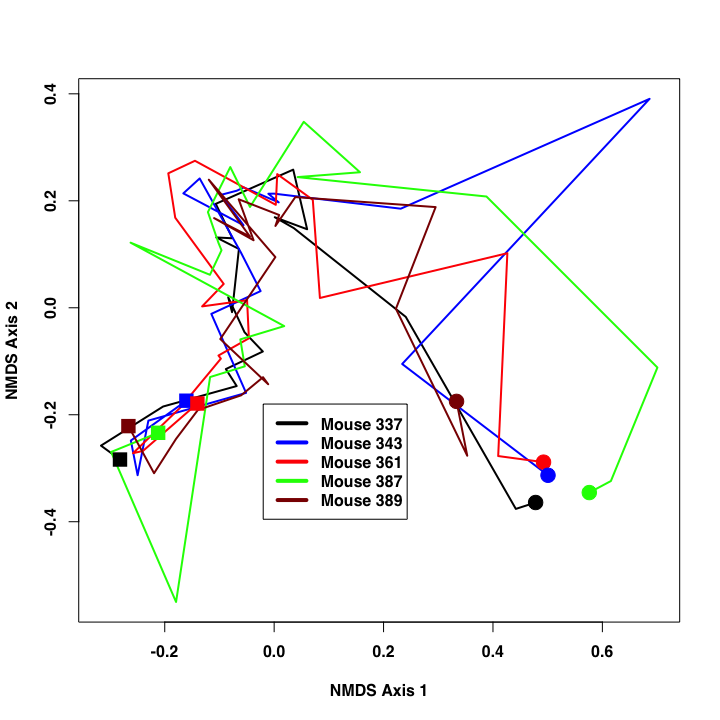

# Assignment 3
Patrick D. Schloss  
September 26, 2014  

Complete the exercises listed below and submit as a pull request to the [Assignment 3 repository](http://www.github.com/microbialinformatics/assignment03).  Format this document approapriately using R markdown and knitr. For those cases where there are multiple outputs, make it clear in how you format the text and interweave the solution, what the solution is.

Your pull request should only include your *.Rmd and *.md files. You may work with a partner, but you must submit your own assignment and give credit to anyone that worked with you on the assignment and to any websites that you used along your way. You should not use any packages beyond the base R system and knitr.

This assignment is due on October 10th.

------

1.  Generate a plot that contains the different pch symbols. Investigate the knitr code chunk options to see whether you can have a pdf version of the image produced so you can print it off for yoru reference. It should look like this:

   

```r
plot(x=1:25,y=rep(1,25),xlab="PCH value",ylab="",pch=1:25,cex=2,col="black",type="p", main="PCH Symbols",axes=F)
segments(x0=1:25,y0=0,x1=1:25,y1=25,col="grey")
axis(1,at=1:25)
```

 


2.  Using the `germfree.nmds.axes` data file available in this respositry, generate a plot that looks like this. The points are connected in the order they were sampled with the circle representing the beginning ad the square the end of the time course:

    

```r
nmds <- read.table(file = "germfree.nmds.axes", header = T)
plot(nmds$axis2[nmds$mouse==337]~nmds$axis1[nmds$mouse==337],col="black",type="l",xlab="NMDS Axis 1",ylab="NMDS Axis 2",ylim=c(-0.6,0.4),xlim=c(-0.4,0.8),lwd=2)
points(nmds[nmds$mouse==337&nmds$day==1,3],y=nmds[nmds$mouse==337&nmds$day==1,4],pch=16,col="black",cex=1.5)
points(nmds[nmds$mouse==337&nmds$day==20,3],y=nmds[nmds$mouse==337&nmds$day==20,4],pch=15,col="black",cex=1.5)
      
lines(nmds$axis2[nmds$mouse==343]~nmds$axis1[nmds$mouse==343],col="blue",type="l",lwd=2)
points(nmds[nmds$mouse==343&nmds$day==1,3],y=nmds[nmds$mouse==343&nmds$day==1,4],pch=16,col="blue",cex=1.5)
points(nmds[nmds$mouse==343&nmds$day==21,3],y=nmds[nmds$mouse==343&nmds$day==21,4],pch=15,col="blue",cex=1.5)
    
lines(nmds$axis2[nmds$mouse==361]~nmds$axis1[nmds$mouse==361],col="red",type="l",lwd=2)
points(nmds[nmds$mouse==361&nmds$day==1,3],y=nmds[nmds$mouse==361&nmds$day==1,4],pch=16,col="red",cex=1.5)
points(nmds[nmds$mouse==361&nmds$day==21,3],y=nmds[nmds$mouse==361&nmds$day==21,4],pch=15,col="red",cex=1.5)
    
lines(nmds$axis2[nmds$mouse==387]~nmds$axis1[nmds$mouse==387],col="green",type="l",lwd=2)
points(nmds[nmds$mouse==387&nmds$day==1,3],y=nmds[nmds$mouse==387&nmds$day==1,4],pch=16,col="green",cex=1.5)
points(nmds[nmds$mouse==387&nmds$day==21,3],y=nmds[nmds$mouse==387&nmds$day==21,4],pch=15,col="green",cex=1.5)
   
lines(nmds$axis2[nmds$mouse==389]~nmds$axis1[nmds$mouse==389],col="brown",type="l",lwd=2)
points(nmds[nmds$mouse==389&nmds$day==1,3],y=nmds[nmds$mouse==389&nmds$day==1,4],pch=16,col="brown",cex=1.5)
points(nmds[nmds$mouse==389&nmds$day==21,3],y=nmds[nmds$mouse==389&nmds$day==21,4],pch=15,col="brown",cex=1.5)

legend(0,-0.2,legend=c("Mouse 337","Mouse 343","Mouse 361","Mouse 387","Mouse 389"),col=c("black","blue","red","green","brown"),border="black",lty=1,lwd=2,cex=.75)
```

 


3.  On pg. 57 there is a formula for the probability of making x observations after n trials when there is a probability p of the observation.  For this exercise, assume x=2, n=10, and p=0.5.  Using R, calculate the probability of x using this formula and the appropriate built in function. Compare it to the results we obtained in class when discussing the sex ratios of mice.


```r
x <- 2
n <- 10
p <- 0.5
bin.coef <- choose(n,x)
result_3_formula <- bin.coef*(p^x)*((1-p)^(n-x))

result_3_function <- dbinom(x,n,p)
```
Probability is 0.0439, and built in function is `dbinorm`.

4.  On pg. 59 there is a formula for the probability of observing a value, x, when there is a mean, mu, and standard deviation, sigma.  For this exercise, assume x=10.3, mu=5, and sigma=3.  Using R, calculate the probability of x using this formula and the appropriate built in function

```r
mean <- 5
sd <- 3
result_4_formula <- 1/((sqrt(2*pi))*sd)*exp(-((x-mean)^2)/(2*(sd^2)))

result_4_function <- dnorm(x,mean, sd)
```
Probability is 0.0807, and built in function is `dnorm`.


5.  One of my previous students, Joe Zackular, obtained stool samples from 89 people that underwent colonoscopies.  30 of these individuals had no signs of disease, 30 had non-cancerous ademonas, and 29 had cancer.  It was previously suggested that the bacterium *Fusobacterium nucleatum* was associated with cancer.  In these three pools of subjects, Joe determined that 4, 1, and 14 individuals harbored *F. nucleatum*, respectively. Create a matrix table to represent the number of individuals with and without _F. nucleatum_ as a function of disease state.  Then do the following:


```r
table_5 <- matrix(data=c(4,1,14,26,29,15),nrow=3,ncol=2)
colnames(table_5) = c("w/F","w/oF")
rownames(table_5)=c("no_sign","adenomas","cancer")
```

    * Run the three tests of proportions you learned about in class using built in R  functions to the 2x2 study design where normals and adenomas are pooled and compared to carcinomas.
    

```r
table_5_pooled <- matrix(data=c(5,14,55,15),nrow=2,ncol=2)
colnames(table_5_pooled)=c("w/F","w/oF")
rownames(table_5_pooled)=c("non_carci","carci")

chisq.test(table_5_pooled)
```

```
## 
## 	Pearson's Chi-squared test with Yates' continuity correction
## 
## data:  table_5_pooled
## X-squared = 16.27, df = 1, p-value = 5.482e-05
```

```r
fisher.test(table_5_pooled)
```

```
## 
## 	Fisher's Exact Test for Count Data
## 
## data:  table_5_pooled
## p-value = 4.094e-05
## alternative hypothesis: true odds ratio is not equal to 1
## 95 percent confidence interval:
##  0.0243 0.3531
## sample estimates:
## odds ratio 
##     0.1007
```

```r
prop.test(table_5_pooled)
```

```
## 
## 	2-sample test for equality of proportions with continuity
## 	correction
## 
## data:  table_5_pooled
## X-squared = 16.27, df = 1, p-value = 5.482e-05
## alternative hypothesis: two.sided
## 95 percent confidence interval:
##  -0.6199 -0.1790
## sample estimates:
##  prop 1  prop 2 
## 0.08333 0.48276
```
The p value for `chisq.test`,`fisher.test`, and `prop.test` are 5.4822 &times; 10<sup>-5</sup>,4.0941 &times; 10<sup>-5</sup>, and 5.4822 &times; 10<sup>-5</sup>.

 
    * Without using the built in chi-squared test function, replicate the 2x2 study design in the last problem for the Chi-Squared Test...
    * Calculate the expected count matrix and calculate the Chi-Squared test statistics. Figure out how to get your test statistic to match Rs default statistic.
    

```r
carci.sums <- margin.table(table_5_pooled,1)
frac.non_carci <- carci.sums["non_carci"]/sum(carci.sums)
frac.carci <- carci.sums["carci"]/sum(carci.sums)
frac.carcinomas <- c(frac.carci,frac.non_carci)

F.sums <- margin.table(table_5_pooled,2)
frac.w <- F.sums["w/F"]/sum(F.sums)
frac.wo <- F.sums["w/oF"]/sum(F.sums)
frac.F <- c(frac.w,frac.wo)

table_5_expected <- frac.carcinomas %*% t(frac.F)
table_5_expected<-expected*sum(table_5_pooled)
rownames(table_5_expected)=c("non_carci","carci")
table_5_expected
```

```
##            w/F w/oF
## non_carci  551 2030
## carci     1140 4200
```

```r
chi.sq <- sum((table_5_expected-table_5_pooled)^2/table_5_expected)
chi.sq
```

```
## [1] 7745
```
    

  
      *	Generate a Chi-Squared distributions with approporiate degrees of freedom by the method that was discussed in class (hint: you may consider using the `replicate` command)

```r
df <- (nrow(table_5)-1)*(ncol(table_5)-1)
plot(seq(0,20,0.05),dchisq(seq(0,20,0.05),df=df),type="l",xlab="ChiSquared Statistic",ylab="Probability with 1 degree of freedom")


arrows(x0=chi.sq,x1=chi.sq,y0=0.4,y1=0.05,lwd=2,col="red")
```

 
      
      
      
      * Compare your Chi-Squared distributions to what you might get from the appropriate built in R functions
      * Based on your distribution calculate p-values
      * How does your p-value compare to what you saw using the built in functions? Explain your observations.


6\.  Get a bag of Skittles or M&Ms.  Are the candies evenly distributed amongst the different colors?  Justify your conclusion.

